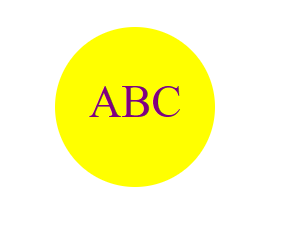

# Logo Generator

## Description

Using this logo generator you will be able to create a simple logo for whatever you need! You can create a circle, square or triangle with a max charcter count of 3. You may also color your text and color whatever you want!

## Table of Contents

- [Description](#description)
- [Installation](#installation)
- [Usage](#usage)
- [License](#license)
- [Contributing](#contributing)
- [Tests](#tests)
- [Questions](#questions)

## Installation

To install this application you must be on the creators terminal to use, so there is currently no way to install this application on your own device.

## Usage

The usage for this application is to create a very simple and clean logo for whatever your needs are.

## License

MIT

## Contributing

Gustavo Diaz

## Tests

Video Link:
https://drive.google.com/file/d/12JYanRIeXVhmfAbZcq0ipvmcfccS1GyT/view

## Questions

NA

For more information, visit my GitHub profile: [diazgus411](https://github.com/diazgus411)

To contact me, send an email to: "diazgus411@gmail.com"